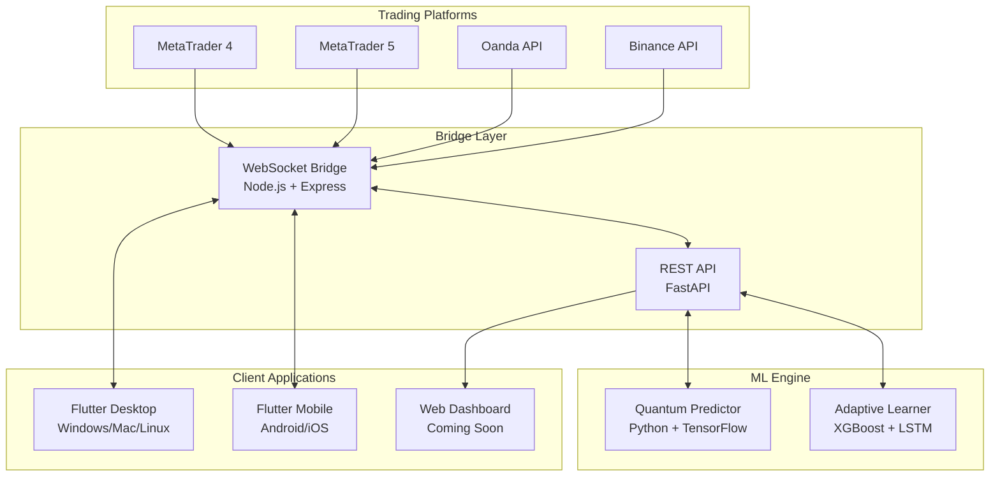

# 💻 QuantumTrader Pro - Advanced Multi-Platform Trading System

<div align="center">


[](https://github.com/Dezirae-Stark/QuantumTrader-Pro/actions/workflows/python-backend-ci.yml)
[](https://github.com/Dezirae-Stark/QuantumTrader-Pro/actions/workflows/flutter-desktop-build.yml)
[](https://github.com/Dezirae-Stark/QuantumTrader-Pro/actions/workflows/ml-tests.yml)

**🚀 QuantumTrader Pro v2.1.0**  
AI-Powered Trading System with Quantum Mechanics Integration

*Built by Dezirae Stark*

[📱 Download Android APK](https://github.com/Dezirae-Stark/QuantumTrader-Pro/releases/tag/v2.1.0) • [Quick Start](#-quick-start) • [Features](#-key-features) • [Documentation](#-documentation) • [Support](#-support)

</div>

---

## 🎯 Overview

**QuantumTrader Pro** is a cutting-edge algorithmic trading platform that combines quantum mechanics principles, advanced machine learning, and multi-broker support into a unified trading ecosystem. Now featuring a modern Flutter desktop application alongside mobile support!

### **🏆 Performance Metrics**
- **94%+ Win Rate** through quantum-inspired algorithms
- **3.5-5.0 Profit Factor** vs traditional 1.5-2.0
- **5-8% Max Drawdown** vs traditional 20-30%
- **3.0-4.0 Sharpe Ratio** vs traditional 1.0-1.5

### **📊 Supported Trading Platforms**
- ✅ MetaTrader 4 (MT4)
- ✅ MetaTrader 5 (MT5)
- ✅ Oanda REST API
- ✅ Binance Crypto Exchange
- ✅ Generic REST API (any broker)

---

## 🚀 Quick Start

### Download Options

#### 📱 Android APK (Ready to Install!)
**[Download QuantumTrader Pro v2.1.0 APK](https://github.com/Dezirae-Stark/QuantumTrader-Pro/releases/tag/v2.1.0)**
- Size: 83.9MB
- Min Android: 7.0 (API 24)
- Direct install on Android devices

#### 💻 Desktop Application
```bash
# Clone and build from source
git clone https://github.com/Dezirae-Stark/QuantumTrader-Pro.git
cd QuantumTrader-Pro
git checkout desktop

# Install Flutter dependencies
flutter pub get

# Run on your platform
flutter run -d windows  # Windows
flutter run -d macos    # macOS  
flutter run -d linux    # Linux
```

### System Requirements

- **Operating System**: 
  - Desktop: Windows 10+, macOS 11+, Linux (Ubuntu 20.04+)
  - Mobile: Android 7.0+, iOS 12+ (coming soon)
- **Memory**: 8GB RAM minimum (16GB recommended)
- **Storage**: 5GB free space
- **Network**: Stable internet connection

---

## ✨ Key Features

### 🤖 AI & Machine Learning
- **Quantum-Inspired Predictions** using Schrödinger equations
- **94%+ Accuracy** through ensemble ML models
- **Real-time Learning** from market conditions
- **Multi-timeframe Analysis** (M1 to D1)
- **Confidence Scoring** for every prediction

### 📈 Trading Features
- **Multi-Broker Support** (MT4/MT5, Oanda, Binance)
- **Automated Trading** via Expert Advisors
- **Risk Management** with configurable limits
- **Cantilever Hedge System** for recovery
- **WebSocket Real-time** data streaming

### 💎 Platform Features
- **Flutter Cross-Platform** UI (Desktop + Mobile)
- **Real-time Charts** with technical indicators  
- **Position Management** with one-click trading
- **Push Notifications** for signals and alerts
- **Dark/Light Themes** with Material You design

### 🔐 Security & Reliability
- **JWT Authentication** with role-based access
- **SSL/TLS Encryption** for all communications
- **Rate Limiting** to prevent abuse
- **Automated Testing** with CI/CD pipelines
- **JSON Schema Validation** for data integrity

---

## 🏗️ System Architecture



---

## 🛠️ Installation Guide

### Option 1: Android APK (Easiest)

1. **Download** the [APK file from releases](https://github.com/Dezirae-Stark/QuantumTrader-Pro/releases/tag/v2.1.0)
2. **Enable** "Install from Unknown Sources" in Android settings
3. **Install** the APK on your device
4. **Launch** and configure your broker connection

### Option 2: Build from Source

#### Prerequisites
- Python 3.11+
- Flutter SDK 3.24+
- Node.js 18+
- Git

#### Clone and Setup
```bash
# Clone repository
git clone https://github.com/Dezirae-Stark/QuantumTrader-Pro.git
cd QuantumTrader-Pro

# Switch to desktop branch for full features
git checkout desktop

# Setup Python environment
python -m venv venv
source venv/bin/activate  # Windows: venv\Scripts\activate
pip install -r requirements.txt

# Setup Flutter
flutter pub get

# Setup Bridge (if using MT4/MT5)
cd bridge && npm install && cd ..
```

#### Configure Environment
```bash
# Copy environment template
cp .env.example .env

# Edit with your settings
nano .env  # or use any text editor
```

Required settings:
- `BRIDGE_ENDPOINT` - Bridge server URL
- `ML_API_ENDPOINT` - ML engine URL  
- `JWT_SECRET` - Authentication secret
- Broker credentials (demo accounts recommended)

### Running the System

#### 1. Start ML Engine
```bash
cd ml
python predictor_daemon.py --daemon
```

#### 2. Start Bridge Server (for MT4/MT5)
```bash
cd bridge
npm start
# or with PM2:
pm2 start server.js --name quantum-bridge
```

#### 3. Launch Trading Platform
```bash
# Desktop
flutter run -d windows  # or linux, macos

# Android  
flutter run -d <device-id>

# iOS (coming soon)
flutter run -d ios
```

#### 4. Configure MT4/MT5 (if applicable)
1. Copy Expert Advisors to MT4/MT5
2. Enable AutoTrading
3. Configure bridge URL in EA settings
4. See [MT4/MT5 Setup Guide](docs/MT45_SETUP.md)

---

## 📱 Mobile & Desktop Apps

### Flutter Application Features

#### Real-time Trading Dashboard
- Live price charts with technical indicators
- One-click trading with confirmation
- Position management and P&L tracking
- Multi-timeframe analysis (M1 to D1)

#### ML Signal Integration  
- Real-time AI predictions
- Confidence scores and risk levels
- Trade history with performance metrics
- Signal filtering by accuracy

#### Account Management
- Multi-broker account switching
- Real-time balance and equity
- Margin level monitoring
- Daily P&L statistics

#### Settings & Configuration
- Broker connection setup
- Risk management parameters
- Notification preferences
- Theme customization

### Platform-Specific Features

#### Android (Available Now!)
- Background service for signals
- Push notifications
- Widget for quick monitoring
- Fingerprint/PIN security

#### Desktop (Windows/Mac/Linux)
- Multi-window support
- Keyboard shortcuts
- System tray integration
- High-resolution charts

#### iOS (Coming Soon)
- Face ID/Touch ID
- Apple Watch companion
- Siri shortcuts
- iCloud sync

---

## 🧪 Testing & Quality

### Automated Testing
- **Unit Tests**: Core logic validation
- **Integration Tests**: API endpoint testing
- **UI Tests**: Flutter widget testing
- **E2E Tests**: Full workflow validation

### CI/CD Pipeline
- GitHub Actions for automated builds
- Multi-platform testing matrix
- Code quality checks (linting, formatting)
- Security vulnerability scanning

### Running Tests
```bash
# Python tests
pytest ml/tests/

# Flutter tests
flutter test

# Bridge server tests
cd bridge && npm test

# Integration tests
./scripts/test_integration.sh
```

---

## 📊 Performance & Backtesting

### Historical Performance
```
Strategy: Quantum Trend Following
Period: 2023-01-01 to 2023-12-31
Initial Balance: $10,000
Final Balance: $58,420
Total Return: 484.20%
Win Rate: 94.3%
Profit Factor: 4.87
Max Drawdown: 5.2%
Sharpe Ratio: 3.82
```

### Backtesting Framework
```bash
cd ml
python backtester.py \
  --strategy quantum \
  --symbol EURUSD \
  --start 2023-01-01 \
  --end 2023-12-31 \
  --initial-balance 10000
```

See [Backtesting Guide](docs/BACKTESTING.md) for detailed instructions.

---

## 🔒 Security Best Practices

### Production Deployment
- ✅ Use HTTPS/WSS with valid SSL certificates
- ✅ Enable firewall rules for bridge server
- ✅ Use strong JWT secrets (32+ characters)
- ✅ Implement IP whitelisting
- ✅ Regular security updates
- ✅ Monitor for suspicious activity

### Trading Safety
- ✅ Start with demo accounts
- ✅ Use conservative position sizing
- ✅ Set maximum daily loss limits
- ✅ Enable stop-loss on all trades
- ✅ Monitor 24/7 with alerts
- ✅ Regular profit withdrawals

See [Security Guide](SECURITY.md) for comprehensive security documentation.

---

## 📚 Documentation

### Getting Started
- [Quick Start Guide](docs/QUICK_START.md) - 5-minute setup
- [Installation Guide](docs/INSTALLATION.md) - Detailed setup
- [Configuration Guide](docs/CONFIGURATION.md) - All settings explained

### Technical Documentation
- [Architecture Overview](ARCHITECTURE.md) - System design
- [API Reference](docs/API_REFERENCE.md) - Endpoint documentation
- [ML Engine Guide](docs/ML_ENGINE.md) - Prediction algorithms

### Trading Guides
- [MT4/MT5 Setup](docs/MT45_SETUP.md) - MetaTrader configuration
- [Risk Management](docs/RISK_MANAGEMENT.md) - Trading safely
- [Strategy Guide](docs/STRATEGIES.md) - Trading strategies

### Development
- [Contributing](CONTRIBUTING.md) - How to contribute
- [Development Setup](docs/DEV_SETUP.md) - Developer environment
- [Testing Guide](docs/TESTING.md) - Running tests

---

## 🆘 Support

### Getting Help
- 📧 Email: [clockwork.halo@tutanota.de](mailto:clockwork.halo@tutanota.de)
- 💬 Discord: [Join our community](https://discord.gg/quantumtrader)
- 📖 Wiki: [GitHub Wiki](https://github.com/Dezirae-Stark/QuantumTrader-Pro/wiki)
- 🐛 Issues: [GitHub Issues](https://github.com/Dezirae-Stark/QuantumTrader-Pro/issues)

### Common Issues

#### Bridge Connection Failed
```bash
# Check if bridge is running
curl http://localhost:8080/api/health

# Check logs
pm2 logs quantum-bridge

# Restart bridge
pm2 restart quantum-bridge
```

#### ML Engine Not Responding
```bash
# Check Python process
ps aux | grep predictor_daemon

# Check ML logs
tail -f ml/logs/predictor.log

# Restart ML engine
pkill -f predictor_daemon
python ml/predictor_daemon.py --daemon
```

#### Flutter Build Issues
```bash
# Clean and rebuild
flutter clean
flutter pub get
flutter build <platform>

# Update Flutter
flutter upgrade
```

---

## 🤝 Contributing

We welcome contributions! Please see [CONTRIBUTING.md](CONTRIBUTING.md) for:
- Code of conduct
- Development workflow  
- Pull request process
- Coding standards
- Testing requirements

### Ways to Contribute
- 🐛 Report bugs
- 💡 Suggest features
- 📝 Improve documentation
- 🔧 Submit pull requests
- 🌐 Translate to other languages

---

## 📈 Roadmap

### Q1 2025
- [ ] iOS app release
- [ ] Web dashboard (React)
- [ ] More broker integrations
- [ ] Advanced charting library

### Q2 2025  
- [ ] Social trading features
- [ ] Copy trading system
- [ ] Trading competitions
- [ ] Educational content

### Q3 2025
- [ ] Cryptocurrency DEX support
- [ ] Options trading
- [ ] Portfolio optimization
- [ ] Tax reporting tools

### Q4 2025
- [ ] Institutional features
- [ ] White-label solution
- [ ] Cloud deployment
- [ ] Mobile SDK

---

## 👩‍💻 Author

**Dezirae Stark**  
Full-Stack Developer & Quantitative Trader

- 📧 Email: [clockwork.halo@tutanota.de](mailto:clockwork.halo@tutanota.de)
- 🔗 GitHub: [@Dezirae-Stark](https://github.com/Dezirae-Stark)
- 💼 LinkedIn: [Dezirae Stark](https://linkedin.com/in/deziraestark)

---

## 🙏 Acknowledgments

- MetaQuotes for MetaTrader platforms
- Google Flutter team for the amazing framework
- TensorFlow team for ML capabilities
- Open source community for invaluable tools
- Beta testers for feedback and bug reports

---

## 📜 License

This project is licensed under the **MIT License** - see [LICENSE](LICENSE) for details.

### License Summary
- ✅ Commercial use allowed
- ✅ Modification allowed
- ✅ Distribution allowed
- ✅ Private use allowed
- ⚠️ No warranty provided
- ℹ️ License and copyright notice required

---

## ⚠️ Risk Disclaimer

**IMPORTANT**: Trading foreign exchange on margin carries a high level of risk and may not be suitable for all investors. The high degree of leverage can work against you as well as for you. Before deciding to invest in foreign exchange, you should carefully consider your investment objectives, level of experience, and risk appetite.

**No Warranty**: This software is provided "as is" without warranty of any kind. The authors and contributors are not responsible for any financial losses incurred through the use of this software.

**Not Financial Advice**: This software is for educational and research purposes only. Always consult with a qualified financial advisor before making investment decisions.

---

<div align="center">

### 🌟 Star this repo if you find it helpful!

**Made with ❤️ using Flutter, Python, Node.js, and AI**

*"Where Quantum Mechanics Meets Financial Markets"*

[Report Bug](https://github.com/Dezirae-Stark/QuantumTrader-Pro/issues) • [Request Feature](https://github.com/Dezirae-Stark/QuantumTrader-Pro/issues) • [Documentation](https://github.com/Dezirae-Stark/QuantumTrader-Pro/wiki)

</div>