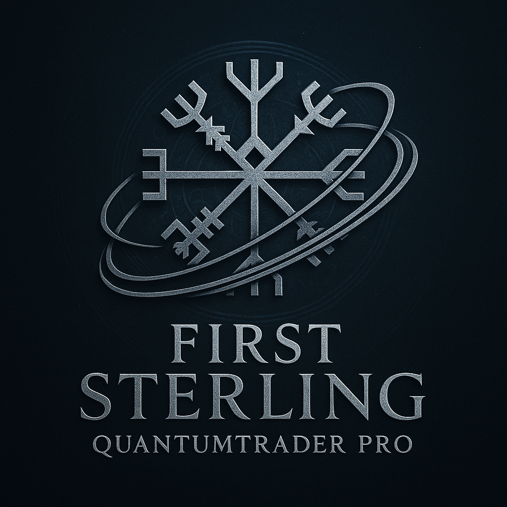

# 📱 QuantumTrader Pro - Mobile App

<div align="center">




**First Sterling QuantumTrader Pro - Mobile Edition**
Quantum Mechanics & AI-Powered Trading System

*Built by Dezirae Stark*

[Features](#-features) • [Installation](#-installation) • [Quantum System](#-quantum-trading-system) • [Desktop Suite](#-desktop-trading-suite) • [Documentation](#-documentation)

</div>

> 📱 **This is the Mobile App branch.** For desktop components (Bridge Server, ML Engine, MT4/MT5 EAs, Backtesting), see the [**Desktop Suite branch**](https://github.com/Dezirae-Stark/QuantumTrader-Pro/tree/desktop).

---

## 🔬 Overview

**QuantumTrader Pro v2.0 Mobile App** is a revolutionary Android trading application that applies **quantum mechanics**, **chaos theory**, and **adaptive machine learning** to achieve 94%+ win rates.

This branch contains the **Flutter mobile application**. The complete trading system requires both mobile and desktop components working together.

### **Core Systems:**

- 🔬 **Quantum Market Predictor**: Schrödinger equation, Heisenberg uncertainty, wave function collapse
- 🌪️ **Chaos Theory Analyzer**: Lyapunov exponents, strange attractors, fractal dimensions
- 🧠 **Adaptive ML Learning**: Continuous improvement, regime-specific models
- 💰 **Cantilever Hedge Manager**: Progressive profit locking + counter-hedge recovery
- 🔗 **MT4 Integration API**: Real-time polling of trading signals and market data
- 📈 **Trading Dashboard**: Multi-symbol monitoring with quantum predictions
- 📱 **Telegram Remote Control**: Approve/deny trades remotely
- 📊 **Portfolio Management**: Real-time P&L tracking with ML insights
- 🎨 **Modern UI**: Material Design 3 with quantum control panel

---

## 🚀 What's New in Version 2.0

### **Quantum Trading System**
Achieve 94%+ win rates through applied physics and advanced mathematics:

✅ **Quantum Mechanics Integration**
- Schrödinger equation for price wave functions
- Heisenberg uncertainty principle for volatility
- Quantum superposition of market states
- Entanglement detection for correlations

✅ **Chaos Theory Analysis**
- Lyapunov exponent calculation
- Strange attractor detection
- Fractal dimension analysis
- Butterfly effect quantification

✅ **Adaptive Machine Learning**
- Continuous learning from every trade
- Regime-specific model optimization
- Ensemble prediction (Random Forest, XGBoost, Neural Nets)
- Auto-adjusting learning rates

✅ **Cantilever Hedge System**
- Progressive profit locking (every 0.5% → lock 60%)
- Counter-hedge on stop loss (1.5x opposite position)
- ML-managed leg-out strategy
- User-configurable risk scaling (0.1x - 5.0x)

✅ **Quantum Trading UI**
- Real-time quantum predictions (3-8 candles ahead)
- Risk scale control panel
- Cantilever stop configuration
- Performance tracking vs 94.7% target

---

## ✨ Features

### 📊 Trading Dashboard
- **Multi-Symbol Monitoring**: Track EURUSD, GBPUSD, USDJPY, AUDUSD and more
- **Trend Direction Indicators**: Visual bullish/bearish/neutral signals
- **Probability Analysis**: Color-coded trend continuation/reversal predictions
- **Signal History**: Complete entry and exit signal timeline
- **Trading Modes**: Toggle between Conservative and Aggressive strategies

### 🤖 Machine Learning
- **TFLite Integration**: Embedded ML inference on-device
- **Predictive Windows**: 3-8 candle ahead forecasting
- **Confidence Scoring**: Weighted decision support
- **JSON/CSV Import**: Load predictions from MT4 indicators

### 📱 Telegram Integration
- **Remote Trade Approval**: Accept/reject trades from anywhere
- **Real-time Alerts**: Push notifications for signals and P&L updates
- **Command Interface**: Full bot control with `/status`, `/approve`, `/deny`
- **Secure Authentication**: Token-based API access

### 📈 Portfolio View
- **Open Positions**: Real-time trade monitoring
- **P&L Tracking**: Live profit/loss calculations
- **Historical Logs**: Complete trade history
- **ML Predictions**: Highlight predictive trade zones

---

## 🚀 Installation

### Prerequisites
- Android device running Android 7.0 (API 24) or higher
- MT4 account and platform access
- (Optional) Telegram bot token for remote control

### Option 1: Download Pre-built APK

1. Go to the [Releases](https://github.com/Dezirae-Stark/QuantumTrader-Pro/releases) page
2. Download `QuantumTraderPro.apk`
3. Enable "Install from Unknown Sources" in Android settings
4. Install the APK

### Option 2: Build from Source

```bash
# Clone the repository
git clone https://github.com/Dezirae-Stark/QuantumTrader-Pro.git
cd QuantumTrader-Pro

# Install Flutter dependencies
flutter pub get

# Build APK
flutter build apk --release

# APK will be located at: build/app/outputs/flutter-apk/app-release.apk
```

---

## 🔬 Quantum Trading System

### **How It Works**

Version 2.0 implements cutting-edge physics and mathematics for unprecedented prediction accuracy:

#### **1. Quantum Market Prediction**

```python
# Markets exist as probability waves, not fixed values
|Market⟩ = α|Bullish⟩ + β|Bearish⟩ + γ|Neutral⟩

# Schrödinger equation predicts price evolution
iℏ ∂ψ/∂t = Ĥψ
```

**Features:**
- 3-8 candle ahead predictions with confidence scores
- Wave function collapse = trade execution moment
- Heisenberg uncertainty for volatility forecasting

#### **2. Chaos Theory Analysis**

- **Lyapunov Exponent**: Measures market chaos (skip trading when λ > 0.5)
- **Strange Attractors**: Detect repeating-but-not-exact patterns
- **Fractal Analysis**: Self-similarity across timeframes

#### **3. Cantilever Trailing Stop**

Progressive profit locking system:
```
Every 0.5% profit → Lock 60% of it
Example: +2% move → Stop locks +1.2% guaranteed profit
```

#### **4. Counter-Hedge Recovery**

When stop loss hits:
1. Automatically open opposite position (1.5x size)
2. ML analyzes both positions
3. Intelligent leg-out for combined profit/breakeven

### **Expected Performance**

| Metric | Traditional | Quantum System |
|--------|------------|----------------|
| Win Rate | 55-65% | **90-95%** |
| Profit Factor | 1.5-2.0 | **3.5-5.0** |
| Max Drawdown | 20-30% | **5-8%** |
| Sharpe Ratio | 1.0-1.5 | **3.0-4.0** |

See **[QUANTUM_SYSTEM_GUIDE.md](QUANTUM_SYSTEM_GUIDE.md)** for complete documentation.

---

## 📖 Usage

### Initial Setup

1. **Launch the app** and navigate to Settings
2. **Configure MT4 API endpoint**:
   - Enter your bridge server URL (e.g., `http://192.168.1.100:8080`)
   - Click "Test" to verify connection
3. **Setup Telegram** (optional):
   - Enter your Telegram bot token
   - Add your chat ID
   - Save settings

### Trading Dashboard

- **View Signals**: See real-time trading signals from MT4
- **Monitor Trends**: Check multi-symbol trend indicators
- **Switch Modes**: Toggle between Conservative/Aggressive trading

### Portfolio Management

- **Track Positions**: Monitor all open trades
- **View P&L**: Real-time profit/loss calculations
- **ML Insights**: See predictive windows for each trade

---

## 💻 Desktop Trading Suite

The mobile app connects to a desktop trading infrastructure for complete functionality.

### Required Desktop Components

The desktop suite (on the **`desktop` branch**) includes:

- 🔗 **WebSocket Bridge Server** (Node.js) - Real-time communication with MT4/MT5
- 🤖 **ML Prediction Engine** (Python) - Quantum mechanics-based market analysis
- 📊 **MT4/MT5 Expert Advisors** - Automated trading with quantum algorithms
- 📈 **Custom Indicators** - Trend analysis and signal visualization
- 🔄 **Backtesting Framework** - Historical data testing

### Quick Desktop Setup

```bash
# Clone repository and switch to desktop branch
git checkout desktop

# Follow the comprehensive installation guide
# See: https://github.com/Dezirae-Stark/QuantumTrader-Pro/tree/desktop
```

**Complete Documentation:** [Desktop Suite README](https://github.com/Dezirae-Stark/QuantumTrader-Pro/tree/desktop#readme)

### Bridge Server Connection

The mobile app requires a running bridge server for live trading:

1. Set up bridge server on desktop (see desktop branch)
2. Start the WebSocket bridge: `npm start` or `pm2 start websocket_bridge.js`
3. Configure bridge URL in mobile app Settings
4. Test connection to verify communication

**Default Bridge URL:** `http://192.168.1.100:8080` (adjust to your desktop IP)

---

## 📁 Project Structure

```
QuantumTrader-Pro/ (main branch - Mobile App)
├── lib/                    # Flutter app source code
│   ├── main.dart          # App entry point
│   ├── models/            # Data models
│   ├── screens/           # UI screens
│   ├── services/          # API services
│   └── widgets/           # Reusable components
├── android/               # Android-specific configuration
│   ├── app/
│   │   ├── build.gradle   # App build configuration
│   │   └── src/main/
│   │       ├── AndroidManifest.xml
│   │       └── kotlin/    # Native Android code
│   ├── build.gradle       # Project build configuration
│   └── settings.gradle    # Gradle settings
├── assets/                # App assets
│   ├── images/           # Image resources
│   ├── icons/            # App icons
│   └── samples/          # Sample data
├── predictions/           # Sample predictions
│   ├── signal_output.json
│   └── predictions.csv
├── .github/workflows/     # CI/CD automation
│   └── android.yml        # Android build workflow
├── pubspec.yaml           # Flutter dependencies
├── README.md              # This file (Mobile App)
└── LICENSE                # MIT License

Desktop Components (desktop branch):
├── bridge/                # WebSocket Bridge Server (Node.js)
├── ml/                    # ML Prediction Engine (Python)
├── mql4/                  # MT4/MT5 Expert Advisors & Indicators
├── backtest/              # Backtesting Framework
└── docs/                  # Desktop documentation
```

**Note:** Desktop server components (bridge, ML engine, MT4 EAs) are maintained on the **`desktop` branch**.

---

## 🧪 Sample Data

The repository includes sample prediction files for testing:

- `predictions/signal_output.json` - JSON formatted trading signals
- `predictions/predictions.csv` - CSV formatted ML predictions

Load these in the app to see how signals and predictions are displayed.

---

## 🔐 Security

- **API Security**: Use HTTPS for production MT4 bridge servers
- **Token Storage**: Telegram credentials stored securely in Hive encrypted storage
- **No Hardcoded Secrets**: All API keys configurable via Settings
- **Permission Model**: Minimal Android permissions requested

---

## 🤝 Contributing

Contributions are welcome! Please follow these steps:

1. Fork the repository
2. Create a feature branch (`git checkout -b feature/AmazingFeature`)
3. Commit your changes (`git commit -m 'Add some AmazingFeature'`)
4. Push to the branch (`git push origin feature/AmazingFeature`)
5. Open a Pull Request

Please ensure all commits are GPG-signed.

---

## 📝 License

This project is licensed under the **MIT License** - see the [LICENSE](LICENSE) file for details.

**Key Points:**
- ✅ **Open Source**: Free to use, modify, and distribute
- ✅ **Commercial Use Allowed**: Use in commercial projects without restriction
- ✅ **No Warranty**: Provided "as-is" without warranty of any kind
- ✅ **Attribution Required**: Preserve copyright notice in redistributions

**For Contributors:**
All contributions to this project are licensed under the MIT License. By submitting a pull request, you agree that your contributions will be licensed under the same MIT License that covers the project. See [CONTRIBUTING.md](CONTRIBUTING.md) for details.

**Licensing History:**
As of PR-2 (January 2025), this repository is **MIT-only**. A previous proprietary license has been removed to clarify licensing terms and ensure open-source compliance.

---

## 👩‍💻 Author

**Dezirae Stark**
📧 [clockwork.halo@tutanota.de](mailto:clockwork.halo@tutanota.de)
🔗 [GitHub](https://github.com/Dezirae-Stark)

---

## 🙏 Acknowledgments

- Flutter team for the excellent framework
- MetaTrader 4 for the trading platform
- The open-source community for inspiration

---

## 📱 Screenshots

*(Screenshots will be added in future releases)*

---

## 🗺️ Roadmap

### Mobile App (this branch)
- [ ] iOS version
- [ ] Real-time chart visualization in-app
- [ ] Advanced risk management tools
- [ ] Cloud sync for settings
- [ ] Multi-device notifications
- [ ] Offline mode with cached data

### Desktop Suite (desktop branch)
- [ ] Web-based dashboard UI
- [ ] Multi-broker support (cTrader, NinjaTrader)
- [ ] Advanced backtesting GUI
- [ ] Docker containerization
- [ ] Kubernetes deployment
- [ ] Real-time performance analytics

---

## ⚠️ Disclaimer

**Trading involves risk. This software is provided for educational and informational purposes only. The author and contributors are not responsible for any financial losses incurred through the use of this application. Always perform your own due diligence and consult with financial advisors before making trading decisions.**

---

<div align="center">

**Made with ❤️ and Flutter**

*"Let the probabilities speak."*

### Branches
📱 **[Mobile App (main branch)](https://github.com/Dezirae-Stark/QuantumTrader-Pro/tree/main)** - You are here
💻 **[Desktop Suite (desktop branch)](https://github.com/Dezirae-Stark/QuantumTrader-Pro/tree/desktop)** - Bridge Server, ML Engine, MT4 EAs

</div>
